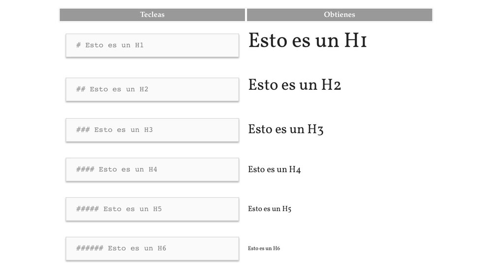
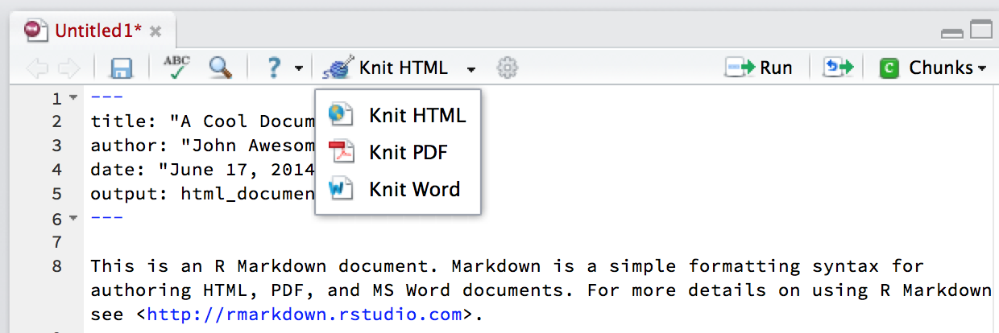
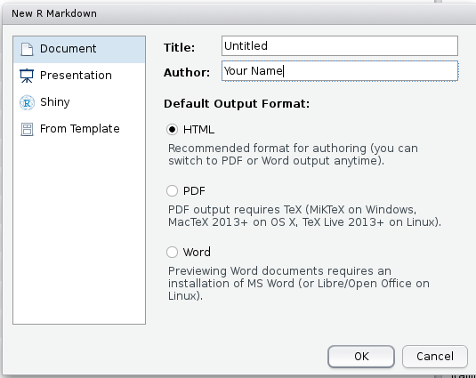
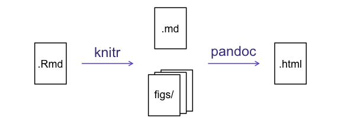
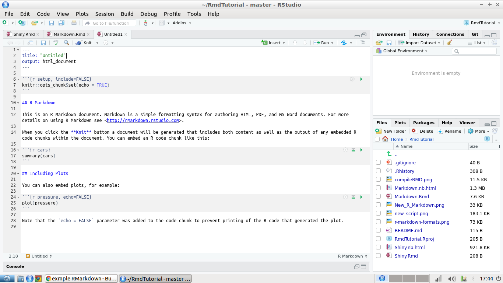

<script src="https://use.typekit.net/dru0rgp.js"></script>
<script>try{Typekit.load({ async: true });}catch(e){}</script>

```{r, echo = F}
knitr::opts_chunk$set(cache  = TRUE, eval = TRUE, include = TRUE)
```

<div class="wrapper">
##¿Qué es Markdown?

Markdown es un lenguaje de marcado ligero creado ["John Gruber"](http://daringfireball.net/projects/markdown/) en 2004,  que busca conseguir la máxima legibilidad y facilidad de publicación tanto de entrada como de salida. Básicamente markdown un lenguaje, y a la vez una herramienta de software que convierte el lenguaje en [XHTML](https://es.wikipedia.org/wiki/XHTML) válido.

Es decir que en lugar de usar codigo [HTML](https://codigofacilito.com/articulos/que-es-html), para publicar, se usa tipado markdown que al compilarse se convierte en código HTML.

### Markdown vs HTML

Para poner un encabezado con Markdown se utiliza 

    # encabezado

La cual al compilarse, es interpretada por el navegador la interpreta como

    <h1>encabezado</h1>
    
En este ejemplo no puede verse una gran ventaja en utilizar markdown en lugar de HTML, sin embargo cuando queremos insertar un link la diferencia puede ser más notoria.


    [Texto](https://link.com)
    
    <a href="https://link.com" target="_blank" title="Texto">Texto</a>

 

###La Sintaxis de Markdown
Existen muchas herramientas y sintaxis en markdown pero en este documento se ejemplifican las principales. Los encabezamientos Markdown se producen colocando un número determinado de almohadillas # antes del texto correspondiente al nivel del encabezadoo deseado, como se muestra en la figura 1.

[](./images/FullSizeRender.jpg) 
  <center>

Figura 1: Tipos de encabezado Markdown 

  </center> 

Es posible tambien cambiar la tipología de la letra, es decir negrita, cursiva, par lo cual se utiliza el asterisco.


    *Cursiva*,  **Negrita**, ~~Tachado~~ y a^Superíndice^


*Cursiva*,  **Negrita**, ~~Tachado~~ y a^Superíndice^

También se pueden Crear listas fácilmente

    * Item 1
        + Item 2a
        + Item 2b
    
    1. Item 1
    2. Item 2
    3. Item 3
        + Item 3a
 


* Item 1
    + Item 2a
    + Item 2b

1. Item 1
2. Item 2
3. Item 3
    + Item 3a


Existen también formas básica de poner links


    <http://example.com>
    
    [link en un texto](http://example.com)
    [](http://example.com)

<http://example.com>


[link en un texto](http://example.com)

[](http://example.com)

El primer caso es un link de una pagian web, la segunda es una imagen insertada, la te lleva a una imagen local, la tercera es una tecto que tinene asociado el enlace a una pagina y la es una imagen que tiene asociada la dirección de un enlace.

También es posible poner ecuaciones tipo LateX utilizando el signo dólar y tablas con ayuda de lo guines.

    $\displaystyle\prod_{i=1}^n p_i$
    $$ \begin{Bmatrix} x & y \\ z & v \end{Bmatrix} $$


$\displaystyle\prod_{i=1}^n p_i$
$$ \begin{Bmatrix} x & y \\ z & v \end{Bmatrix} $$
Para crear una tabla

    First Header  | Second Header
    ------------- | -------------
    Content Cell  | Content Cell
    Content Cell  | Content Cell
    

First Header  | Second Header
------------- | -------------
Content Cell  | Content Cell
Content Cell  | Content Cell

  <div class="row"><hr></div>

##R Markdown


Teniendo en cuenta estas ventajas de markdown y el enfoque de R en la estadistica y el deseo por generar conocimiento con transparencia, [Yihui Xie](https://yihui.name/en/) creo el paquete [knitr](https://cran.r-project.org/web/packages/knitr/index.html).

El cual aprovecha las caracteristicas de Markdown, [latex](https://www.latex-project.org/)), y html para generar reportes en múltiples formatos, figura 2, sin la necesidad un editor externo.


[](./images/r-markdown-formats.png)
 <center>

Figura 2: Formatos Knitr

 </center> 

Cuando el paquete knit esta instalado en R, se puede crea un docum ento de Rmarkdown, utilizando el boton nuevo docuemnto del menú de Rstudio, figura 3.


Al dar click en crear un documento nuevo nos saldrán los tipos de archivos que se pueden crear, de los cuales se elige el R Markdown.

[](./images/new_script.png)
<center>

Figura 3: Menú nuevo documento R studio

</center>

Cuando se selecciona esta opción aparece una ventana que nos permite elegir entre tres tipos documentos, presentación o aplicación que es el que indica la opción shiny.

R Markdown permite además tres tipos de documentos a la salida HTML, que es una página web, PDF y Word. Además de esto permite elegir un nombre y asignar el autor.

[](./images/New_R_Markdown.png)
<center>

Figura 4: Formatos RMarkdown 

</center>

  
###¿Como se compila?

Cuando se selecciona el botón  botón ``Knit`` el documento R Markdown es procesado por knitr y un documento Markdown simple es producido el código R es ejecutado y reemplazado por ambas la entrada y la salida; si las figuras son producidas, se incluyen enlaces a esas figuras.

Los documentos Markdown y figura son entonces procesados por la herramienta pandoc, que convierte el archivo Markdown en un archivo html, con las figuras embebidas. Teniendo en cuenta lo anterior, para poder visualizar el documento final, se tienen dos opciones para compilarlo, la más facil de ellas es utilizando [RStudio](https://www.rstudio.com/), el cual basta con tener instalado el paquete ``rmarkdown``, la otra opción es utilizando [R](https://www.r-project.org) e instalar tambien [Pandoc](http://pandoc.org).


  [](./images/compileRMD.png)
<center>

Figura 5: Compilación de archivo.Rmd tomada de [1]

  </center>
  <div class="row"><hr></div>
  
##El Primer Rmarkdown

[](./images/documentexample.png)
 <center>

Figura 6: Documento ejemplo archivo .Rmd

</center>

Al crear el primer documento Rmarkdown, R por defecto pone un ejemplo, figur 6. Lo primero que se observa es la cabecera, va entre tres líneas y allí se especifica el título del documento, el autor, la fecha, todo de manera opcional, junto con la salida del documento, con la palabra ``output``, en la que se puede editar el tipo de salida que se especificó inicialmente (html_document, Word_document, pdf_document, html_notebook), o incluso que se generen varias salidas.

    ---
    title: "Documento inicial **R Markdown**"
    author: "Karl Broman"
    date: "23 de Abril de 2015"
    output: html_document
    ---
    
Las comillas dobles no son estrictamente necesarias en el título, sin embargo son necesarias si se desea incluir dos puntos en el título. 

###El texto

RStudio crea el documento con un texto de ejemplo para  a empezar, con el fin de ilustrar el uso del paquete. Además del tipado markdown y HTML. Los documentos en Rmarkdown pueden contener, texto plano, trozos o chucks de código en línea

###Bloques de Código

Una de las ventajas de RMarkdown, es que permite integrar bloques de código. Los bloques de código van encerrados por tres acentos, seguidos de el nombre del lenguaje de programación, y van resaltados con un fondo gris, también pueden insertarse desde el botón insert.


    ´´´{r}
    Chunk de R
    ´´´

R markdown por defecto permite utilizar tambien, [Bash](https://www.gnu.org/software/bash/), [Python](https://www.python.org/), [C++](https://cran.r-project.org/web/packages/Rcpp/index.html), [SQL]() y [Stan](http://mc-stan.org/). Cada bloque de código, tiene en la parte superior derecha tres botones, el primero, es un engranaje que permite, configurar el r chorkcut, las alertas de error e incluso nombrarlo, El segundo es una flecha hacia abajo  que permite ejecutar todos los bloques de código anteriores a este y por último el botón de play que permite ejecutar el bloque de código.

Al ejecutar un bloque de código aparece el resultado, también debajo del codigo que se ejecuto, o en caso de haber errores, estos también se muestran en la parte de debajo

```{r}
summary(cars)
```

###Include y echo
Las funciones ``include`` Y ``echo`` permiten que se muestre o no, el bloque de código y el resultado respectivamente.


    ´´´{r, include = F, Eval = T, Echo = F}
    
    Chunk de R
    
    ´´´


En ocasiones cuando se desea utilizar python en R no es posible realizar no se identifican los paquetes y es necesario configurarlo como se muestra en la documentación de Rcran; [R Markdown Python Engine](https://cran.r-project.org/web/packages/reticulate/vignettes/r_markdown.html), o tambien es posible hacer uso de el paquete [reticulate](https://cran.r-project.org/web/packages/reticulate/index.html), utilizando bloques de R [Python Version Configuration](https://cran.r-project.org/web/packages/reticulate/vignettes/versions.html).

<div class="row"><hr></div>

##Configuración del documento


Para configurar los valores por defecto del documento, se puede hacer uso de la función ``knitr::opts_chunk$set``, una de las maś útiles cuando se realizan informes muy largos o con códigos que tardan mucho tiempo en compilar, de modo que es conveniente guardar el cache de modo que cuando se cierre el documento, no sea necesario volver a correr todos los códigos nuevamente y poder continuar donde se dejó.


```{r, eval=F}
knitr::opts_chunk$set(cache  = TRUE)
```

###Tamaño de Imágenes

En RMarkdown se puede hacer uso de todos los paquetes de R, entre ellos, aquellos que tienen que ver con gráficos, adicionalmente, al ser una herramienta para hacer informes, este también permite cambiar el tamaño de las imágenes


```{r}
plot(cars$speed, main="Tamaño por defecto") 
```


    ´´´{r plot, fig.height = 4 , fig.width = 9}

```{r plot, fig.height = 4 , fig.width = 9}
plot(cars$speed, main="Tamaño modificado")
```

###Código in-line

Además de esto Rmarkdown tiene la capacidad de ejecutar códigos dentro del mismo texto, haciendo uso de tilde simple con r, seguido de la función `` `r ncol(cars)` ``, y hacer uso de códigos markdown o html sobre esta.

###Strings Externos

En ocasiones se quiere mostrar el contenido de strings previamente escritos por aparte, además de la finción ``read_chunk``, que permite utilizar el código de cualquier archivo .R por medio de su ubicación.

```{r, eval=FALSE}
knitr::read_chunk('map.R')
```

###Temas

Además de todo lo anterior RMarkdown, permite también elegir un tema para el documento, e incluso crear otro para darle un aspecto más bonito, se pueden ver los temas en la [Galeria](https://rmarkdown.rstudio.com/gallery.html)de Rstudio.

###El menú de navegación

Por otra parte RStudio en la parte de abajo del editor, hay un botón pequeño que cambia de color con un texto a la derecha que indica en qué parte del documento se está trabajando y al lado derecho un botón en forma de flechas que permite navegar por el documento por medio de títulos y secciones.  

 <div class="row"><hr></div>

##Paquetes complementarios

###El paquete htmlTable

RMarkdown tiene como objetivo la presentación de informes, sin embargo, salida de los código no es la más estética, por lo que RMarkdown permite también generar tablas HTML, para mostrar las salidas. Para esto se hace uso del paquete ``htmlTable``, se puede utilizar ``caption`` para comentar al principio de la tabla y ``tfoot`` para poner un pie a la tabla.

```{r}
library(htmlTable )
htmlTable(head(cars),
          caption = "Título de la tabla",
          tfoot = "este es el pie de tabla")
```

Se puede tambien cambiar el estilo de las tablas, como por ejemplo colores intercalados por fila para facilitar la visualización.

```{r}
library(htmlTable )
htmlTable(head(cars),
          tfoot = "este es el pie de tabla",
          col.rgroup = c("none", "grey"))
```

 <div class="row"><hr></div>
 
###Referencias

[1] <https://swcarpentry.github.io/r-novice-gapminder-es/15-knitr-markdown/>

[2] <https://bookdown.org/yihui/rmarkdown/yihui-xie.html>

<div class="nine" style="margin-top:12rem;">
  <hr>  
  <h3>Para ponerse en contacto, <a href="mailto:johanmarin@criptext.com">johanmarin@criptext.com</a>.</h3>
  </div>
  <div class="row" style="margin-top:5rem;">
  <hr class="f">
  <div class="footer">
  <a href="https://github.com/johanmarin" title="github @johanmarin" target="_blank">
  <div class="github social"></div>
  </a>
  &copy; 2019 <a class="social" href="https://www.linkedin.com/in/johan-david-mar%C3%ADn-benjumea-742a45142" target="_blank">Johan Marin</a>.  Made in COL.
<a href="https://johanmarin.github.io/otterblog/" title="blog @otterblog" target="_blank">
  <div class="logo2x social"></div>
  </a>
  </div>
  </div>
  </div>
  </div>