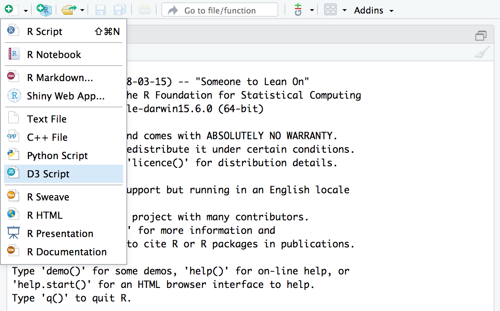

<script src="https://use.typekit.net/dru0rgp.js"></script>
<script>try{Typekit.load({ async: true });}catch(e){}</script>

```{r, echo = F}
knitr::opts_chunk$set(cache  = TRUE, eval = TRUE, include = TRUE)
```

<div class="wrapper">

##Shiny
Shiny es un paquete que permite crear aplicaciones web interactivas, directamente desde Rstudio, este paquete viene instalado por defecto con Rstudio. Y tiene como finalidad la interacción gráfica con los datos.

 [](./images/new_script.png)
<center>

Figura 1: Menú nuevo documento R studio

</center>
 
Para crear una app en el menú nuevo, figura 1, se elige la opción Shiny Web App.

En shiny la interfaz de usuario o interfaz gráfica, se suele denominar **ui.R** y el servidor **server.R**, cada uno en un script diferente, sin embargo desde la versión 3.0 de R shiny puede crearse desde un solo fichero, en lugar de tener un fichero ``ui`` y uno ``server``, en un mismo archivo habrá una función para cada uno de ellos, que se compilan al final con ``shinyApp(ui = ui, server = server)``. 

[](./images/shinyCreate.png)
<center>

Figura 2: Menú nueva shiyn app

</center>
<div class="row"><hr></div>
  
##Primera App con Shiny

[](./images/shinyshot.png)
<center>

Figura 3: Ejemplo shiny app Rstudio

</center>

Por defecto Rstudio pone por defecto una app sencilla con un histograma, para que se pueda interactuar y observar el funcionamiento básico de una app en shiny. Ahí se puede modificar fácilmente las entradas en el espacio de diseño ``sidebarLayout``.

    &beta;
  &beta;

###Shiny ui

De la misma manera que Rmarkdown, Shiny también permite hacer uso de HTML, para darle formato al texto. Insertar imágenes, insertar caracteres especiales,ademas de comandos latex, precedidos por el  ampersand, teminados con punto y coma


```{r uiExample, eval= F}
ui <- fluidPage(
   
   # Application title
   titlePanel("Old Faithful Geyser Data"),
   
   # Sidebar with a slider input for number of bins 
   sidebarLayout(
      sidebarPanel(
         sliderInput("bins",
                     "Number of bins:",
                     min = 1,
                     max = 50,
                     value = 30)
      ),
      
      # Show a plot of the generated distribution
      mainPanel(
         plotOutput("distPlot")
      )
   )
)

```

####Entradas en Shiny ui
 
Una de las características de shiny es que permite que el usuario pueda modificar lasne varios y cosas desde la interfaz gráfica, para esto shiny tipos de entrada; el que viene por defecto en el ejemplo es sliderinput, sin embargo Shiny permite crear también otros tipos de entrada.

Lo primero que se debe de hacer es ubicar dónde estarán las entradas, por defecto shiny utiliza un ``sidebarPanel`` una barra donde generalmente se ubican las entradas y que por defecto se alinea en la parte superior izquierda del espacio de diseño.

* ``sliderInput`` Permite crear una barra con una escala numérica a través de la cual el usuario puede elegir un número.
* ``selectInput`` Permite crear una lista de opciones, de las cuales el usuario puede seleccionar una de ellas.

Cada una de estas entradas tienen varios argumentos:


* ``ID`` Permite asignarle un nombre a la entrada de modo que se pueda identificar desde cualquier parte del código; en el ejemplo por ejemplo utiliza "bins".
* ``Nombre`` Permite poner texto sobre el botón de modo que sea visible para el usuario; "Number of bins:".
* ``Values`` Luego se ponen los valores que puede seleccionar el usuario, Este argumento varía según el tipo de entrada que se tenga.
 sliderInput:  Tal y como se muestra en el ejemplo se elige el máximo y el mínimo en la escala,por defecto R elige una escala, sin embargo puede elegirse el tamaño mínimo de este, utilizando el comando ``step = ``.
selectInput: En este caso los valores se asignan utilizando el argumento **choices = ** una lista con la función concatenar de R ``c()``.
* ``Animation`` Este argumento permite que la entrada se pueda ejecutar de forma animada, cuando este este tiene como valor verdadero, aparece un botón de play que al accionarlo hace que los valores cambien automáticamente, puede tomar los valores ``TRUE`` ó ``FALSE``.
* ``value`` Es el valor por defecto es el valor que tendrá la entrada cuando se inicia la app.


####Salidas de Shiny ui
En la ``ui`` también se debe de especificar, cual es el tipo de salida que mostrará la app, esto se hace dentro de una parte de la app llamada mainPanel esté es el espacio que queda al lado derecho de la barra de entradas. dentro de esta función se pueden utilizar varios tipos de salidas.

* ``p`` Es el tipo de salida más básico y permite ponerle título o hacer observaciones de la app, y para esto se utilizan los mismos comandos de HTML.
* ``verbatimTextOutput`` Permite observar resultados en código.
* ``plotOutput`` Permite mostrar gráficas estáticas, generadas por los paquetes plot, ggplot, etc.
* ``plotlyOutput`` Permite mostrar gráficas dinámicas, generadas con el paquete Plotly.

De la misma forma que sucede con las entradas, las salidas también tienen como entradas algunos argumentos.

* ``ID`` De la misma forma que con las entradas permite seleccionar la salida desde cualquier parte del código.

* ``Aling`` Permite elegir la alineación de la salida; no siempre funciona correctamente.
* ``height y Width`` Permiten definir el alto y ancho que ocupará la salida en px.

###Shiny Server

```{r ServerExample, eval= F}
# Define server logic required to draw a histogram
server <- function(input, output) {
   
   output$distPlot <- renderPlot({
      # generate bins based on input$bins from ui.R
      x    <- faithful[, 2] 
      bins <- seq(min(x), max(x), length.out = input$bins + 1)
      
      # draw the histogram with the specified number of bins
      hist(x, breaks = bins, col = 'darkgray', border = 'white')
   })
}

```

Como ya se mencionó el server lo que hace es realizar todas las operaciones internas para que la app funcione, para hacer esto shiny hace uso de las salidas y entradas con las que interactúa el usuario, para esto se utilizan dos comandos ``Input\$ID`` para la entrada y ``output\$ID`` para la salida, para llamar entradas y salidas respectivamente.

Shiny permite también crear una barra que permita tener una app multipágina, esto se hace utilizando el comando ``tabPanel()`` y dentro de la función lo que irá dentro de cada una de las pestañas. En el caso de que se quiere utilizar las mismas entradas para todas las pestañas se utiliza la función ``tabsetPanel``.

<div class="row"><hr></div>

##Funciones importantes

###La función render
Para poder que las salidas de la App sean dinámicas; es decir cambian con los cambios que realiza el usuario, Shiny hace uso de la función ``render``, esta función puede cambiar dependiendo el tipo de salida que se tenga, para las salidas mencionadas en el punto anterior.

* ``renderText`` Para el código.
* ``renderPlot`` Para gráficos estáticos.
* ``renderPlotly`` Para gráficos de Plotly.

Existen otras opciones de esta función, cuya documentación en R o Rstudio se puede ver con el comando ``?shiny::render`` y la tecla tabular.

Dentro de la función render las funciones funcionan de la misma forma que lo hacen en un script de R.

###La Función reactive
En ocasiones es necesario hacer que también las entradas e incluso los datos cambien de acuerdo a lo que selecciona el usuario, reactive, es una forma de llamar a las funciones que se ejecutan cuando el usuario selecciona una opción.
  
Por ejemplo en el siguiente que de código cuando el usuario selecciona un año y una región, la base de datos cambia se reduce a los que cumplen las condiciones, en caso contrario se muestra la base de datos completa.


```{r reactivexample, eval= F}
  selectData <- reactive({
    l <- data$year == input$year & data$region != "total"
    
    if(input$region != 'total'){
      l <- l & data$region %in% input$region
    }
    l
  })
```


###Función Conditional

En ocasiones también se requiere que toda la interfaz cambie según las opciones que elija el usuario para esto se utiliza la función ``conditionalPanel`` lo  que permite que cuando se cumple una condición.

Esta función tiene como argumentos, ID y condición.

```{r panelExample, eval= F}
conditionalPanel("nombre",
                 condition = "input.plot_type == 'opción'",
                 #A partir de este punto va el contenido del panel
)
```
   <div class="note">
   
   Shiny ofrece muchas otras funciones útiles, a las que se puede acceder fácilmente desde [function refence](https://shiny.rstudio.com/reference/shiny/1.0.5/) de shiny from RStudio.

 </div>


  <div class="row"><hr></div>

##Integrar Shiny y Rmarkdown

Es posible Integrar Shiny con  Rmarkdown, pudiendo generar cosas como simulaciones dentro de un Rmarkdown para esto se utiliza la librería ``install_phantomjs`` del paquete ``webshot``*. 

```{r paqueteNes, eval= F}
install.packages("webshot")
webshot::install_phantomjs()
```

Teniendo instaladas las librerías anteriores, pueden integrarse de varias formas, la primera es, alojando la app en un servidor y se vincula con el Rmd utilizando la URL donde está alojada la app.

```{r appcomoin, eval= F}
knitr::include_app("/URL_de_la_app")
```

Es importante saber que por defecto la altura y el ancho de la entrada de la app es de 400px, por lo que es posible que se vea recortada y con barras de desplazamiento, para evitar esto se puede editar el tamaño de este para poder que se vea bien la app.

```{r exarezise, eval= F}
knitr::include_app("/URL_de_la_app", height = 450, width = 300)
```

<center>

```{r appExample , echo=FALSE}
knitr::include_app("https://yihui.shinyapps.io/miniUI/", height = "600px")
```

</center>

En ocasiones no se quiere insertar la app directamente, sino que se quiere poner un pantallazo de la misma, **knitr** tiene una función que permite hacer esto de forma automática.


```{r rezise example, eval=FALSE}
appshot(app = "./appExample/", file = "./images/shinyshot.png", vheight = 400)
```

  
Esto guarda una screenshot de la app en formato png en la carpeta de origen, con el nombre shinyshot y se puede ahora mostrar.

```{r imageExpefcas, eval=FALSE}

```

<div class="row"><hr></div>

###Referencias


[1] <https://shiny.rstudio.com/reference/shiny/1.0.5/>

[2] <https://beta.rstudioconnect.com/content/2671/Combining-Shiny-R-Markdown.html>

[3] Xie, Yihui. 2018. bookdown: Authoring Books and Technical Documents with R Markdown <https://bookdown.org/yihui/bookdown/>

<div class="nine" style="margin-top:12rem;">
  <hr>  
  <h3>Para ponerse en contacto, <a href="mailto:johanmarin@criptext.com">johanmarin@criptext.com</a>.</h3>
  </div>
  <div class="row" style="margin-top:5rem;">
  <hr class="f">
  <div class="footer">
  <a href="https://github.com/johanmarin" title="github @johanmarin" target="_blank">
  <div class="github social"></div>
  </a>
  &copy; 2019 <a class="social" href="https://www.linkedin.com/in/johan-david-mar%C3%ADn-benjumea-742a45142" target="_blank">Johan Marin</a>.  Made in COL.
<a href="https://johanmarin.github.io/otterblog/" title="blog @otterblog" target="_blank">
  <div class="logo2x social"></div>
  </a>
  </div>
  </div>
  </div>
  </div>


